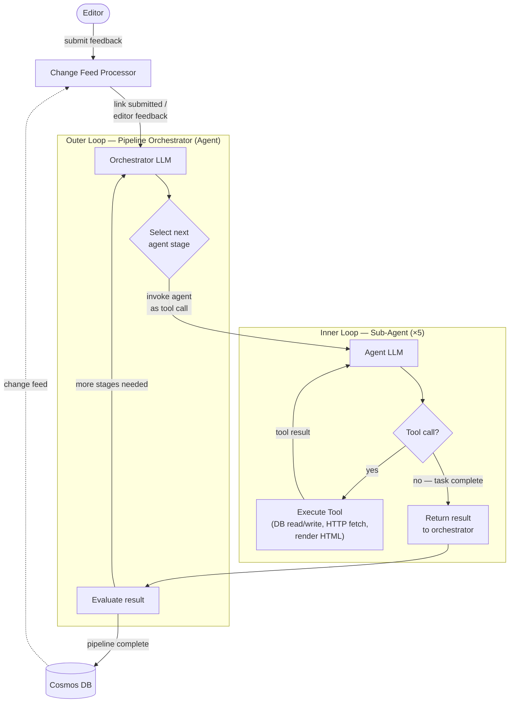

# The Agent Stack

An event-driven, agent-powered editorial pipeline that transforms curated links into polished newsletter editions — entirely through LLM-driven agents. While it currently powers "The Agent Stack" (a newsletter about Agentic Engineering), the pipeline is a general-purpose editorial automation engine that can be adapted for any newsletter or content curation workflow.

The system orchestrates five specialized agents — **Fetch**, **Review**, **Draft**, **Edit**, and **Publish** — coordinated by a pipeline orchestrator. An editor submits links through a private dashboard; the Cosmos DB change feed triggers the agent pipeline, which fetches and parses content, evaluates relevance, composes structured newsletter sections, refines tone and coherence, and renders the final edition as a static site. The dashboard provides real-time progress via SSE and supports per-section editorial feedback that agents incorporate in subsequent iterations.

Built on [Microsoft Agent Framework](https://github.com/microsoft/agent-framework), FastAPI, HTMX, and Azure Cosmos DB. See [`docs/SPECIFICATION.md`](docs/SPECIFICATION.md) for the full project specification — architecture, data model, component design, and tech stack. For visual architecture diagrams, see [`docs/ARCHITECTURE.md`](docs/ARCHITECTURE.md).

## Agentic Loop

The system implements a nested two-loop architecture — an **outer orchestrator loop** that coordinates agents as tool calls, and an **inner agentic loop** where each agent iterates with the LLM until its task is complete.



> **Outer loop** — the orchestrator's LLM decides which agent to invoke next (Fetch → Review → Draft, or Edit/Publish), treating each sub-agent as a callable tool. After each agent returns, the orchestrator re-evaluates and either continues to the next stage or completes the pipeline.
>
> **Inner loop** — each sub-agent runs its own LLM session, iteratively calling tools (database reads/writes, HTTP fetches, HTML rendering) until the task is done. The LLM autonomously decides which tools to call and when to stop.
>
> **Human-in-the-loop** — editor feedback creates a new Cosmos DB change feed event, re-entering the outer loop through the Edit agent for content refinement.

## Project Structure

```
src/agent_stack/
├── agents/          # Agent implementations, LLM client, middleware, prompt loader, registry
├── auth/            # Microsoft Entra ID authentication (MSAL)
├── database/
│   ├── client.py    # Cosmos DB client
│   └── repositories/  # Per-entity repository layer
├── events/          # SSE event manager for real-time updates
├── models/          # Pydantic data models
├── pipeline/        # Orchestrator and change feed processor
├── routes/          # FastAPI route handlers
├── services/        # Domain services, health checks, and status utilities
├── storage/         # Azure Blob Storage client and static site renderer
├── app.py           # FastAPI application factory
└── config.py        # Configuration from environment variables
prompts/             # Agent system prompts (Markdown)
templates/
├── *.html           # Dashboard views (Jinja2 + HTMX)
├── newsletter/      # Public newsletter templates (index + edition)
└── partials/        # HTMX partial fragments (agent activity, run items, edition title, link progress)
infra/               # Bicep infrastructure modules
tests/               # Unit and integration tests
```

## Local Development

See [`docs/DEVELOPMENT.md`](docs/DEVELOPMENT.md) for detailed setup instructions, including fully local development with [Foundry Local](https://github.com/microsoft/foundry-local) (no Azure subscription required) and cloud-connected options.

### Quick Start

```bash
uv sync --all-groups --prerelease=allow
docker compose up -d
cp .env.example .env
# Edit .env — set FOUNDRY_PROVIDER=local for fully local, or configure cloud credentials
uv run uvicorn agent_stack.app:create_app --factory --reload --reload-dir src
```

### Tests

```bash
uv run pytest tests/ -v
```

### Linting, Formatting & Type Checking

```bash
uv run ruff check src/ tests/
uv run ruff format src/ tests/
uv run ty check src/
```

## Pipelines

GitHub Actions with five workflows. Check and Test run in parallel on push / PR to `main`; Build, Release, and Deploy chain sequentially via `workflow_run` triggers. All Azure-facing workflows authenticate using OIDC federated credentials.

| Workflow | File | Trigger | Responsibility |
|---|---|---|---|
| **Check** | `check.yml` | Push / PR to `main` | Lint, format check, type check |
| **Test** | `test.yml` | Push / PR to `main` | Unit tests |
| **Build** | `build.yml` | Check + Test success on `main` | Docker build, push to ACR, Bicep validation |
| **Release** | `release.yml` | Build success on `main` | Bicep infrastructure deployment |
| **Deploy** | `deploy.yml` | Release success on `main` | Container App update |

### Manual Deployment

```bash
az deployment group create \
  --resource-group <rg-name> \
  --template-file infra/main.bicep \
  --parameters infra/params/prod.bicepparam
```
