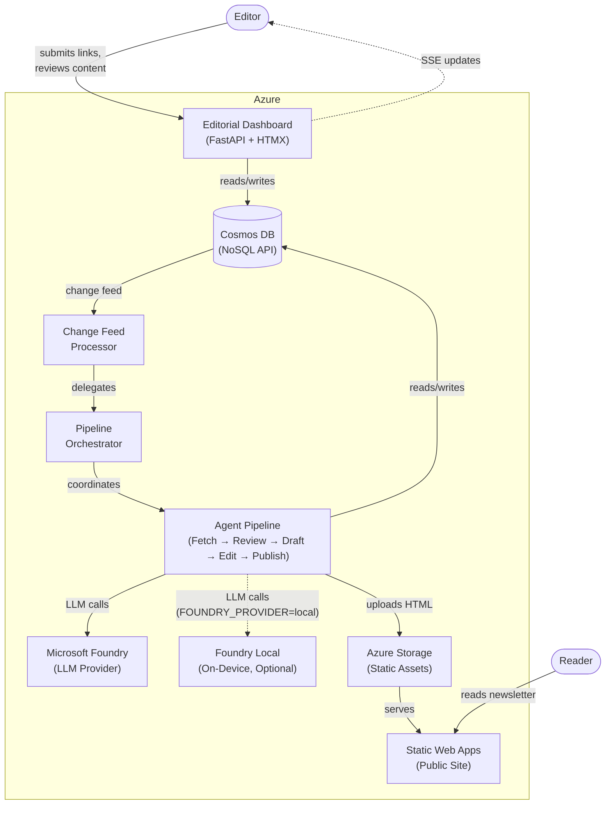
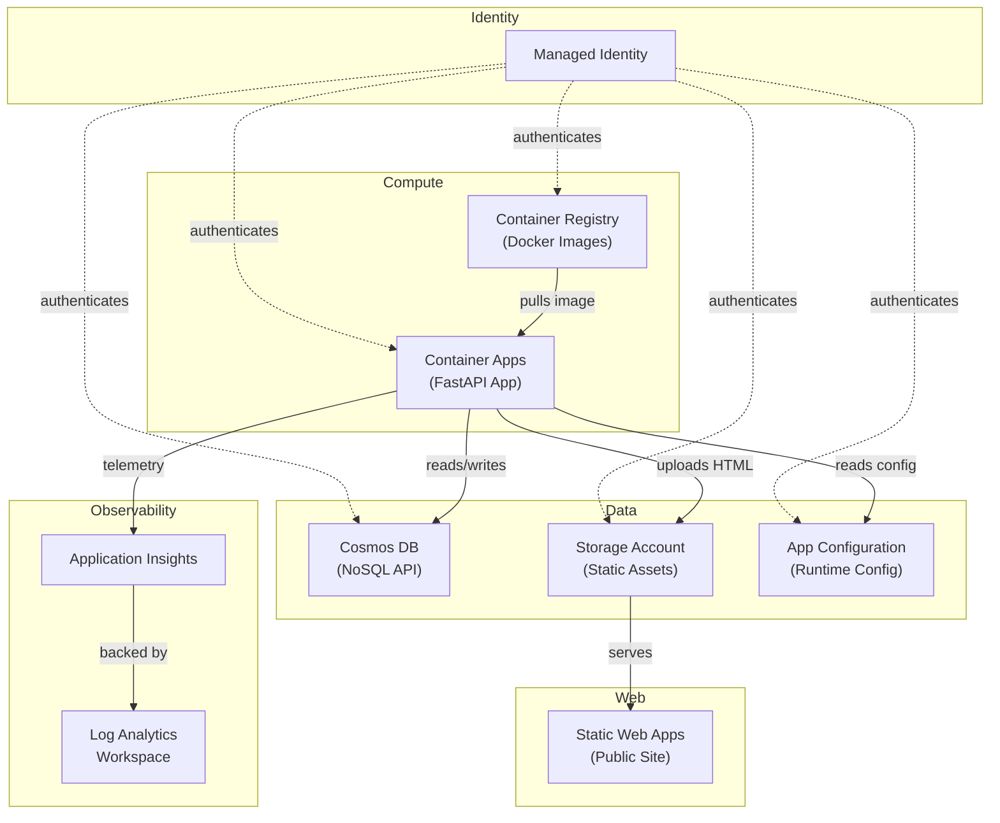
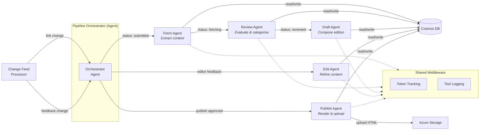
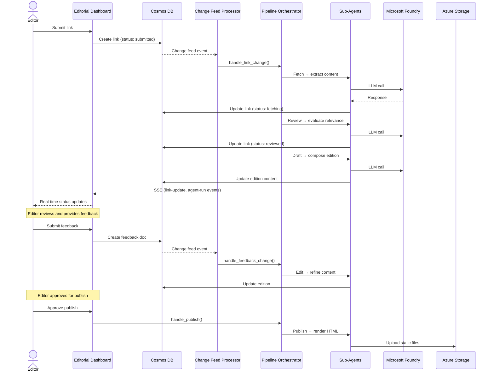
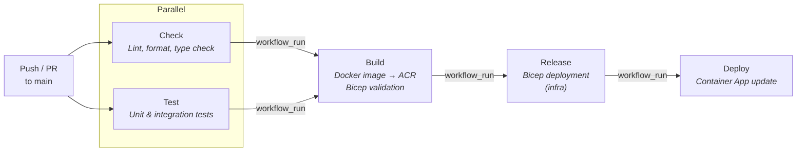

# Architecture

This document provides a visual overview of The Agent Stack — an event-driven, agent-powered editorial pipeline for a newsletter about Agentic Engineering. Each section includes a diagram and a brief explanation of the components involved.

## System Overview

The platform has three main surfaces: an editorial dashboard where editors submit links and review content, an agent pipeline that autonomously processes links into newsletter editions, and a static site where published editions are served to readers. Cosmos DB sits at the centre as both the data store and the event backbone — its change feed is what drives the entire pipeline without any external message broker.

## Azure Infrastructure

All infrastructure is defined as Bicep templates in `infra/`. A single managed identity provides passwordless authentication between services — Container Apps uses it to access Cosmos DB, Storage, Container Registry, and App Configuration. Application Insights and Log Analytics handle observability, while Static Web Apps serves the public newsletter from blob storage.

## Agent Pipeline

The pipeline is orchestrated by a central `PipelineOrchestrator` — itself an Agent Framework agent — that coordinates five specialised sub-agents via tool calls. When a link is submitted, it flows sequentially through Fetch (extract content), Review (evaluate relevance), and Draft (compose newsletter copy). The Edit stage runs when an editor provides feedback on an edition, and Publish renders the final HTML and uploads it to storage. Each sub-agent has its own system prompt, registered tools, and middleware (token tracking).

## Event-Driven Data Flow

The system is event-driven with no external message broker — Cosmos DB's change feed is the sole event source. When a document is created or updated, the change feed processor picks it up and delegates to the orchestrator, which invokes the appropriate agent stage. As agents progress, they update documents in Cosmos DB (which may trigger further processing) and publish SSE events so the editorial dashboard updates in real time.

## CI/CD Pipeline

The CI/CD pipeline is a chain of five GitHub Actions workflows connected via `workflow_run` triggers. Check and Test run in parallel on every push or PR to `main`. Once both pass, Build creates the Docker image and validates the Bicep templates. Release deploys the infrastructure, and Deploy updates the Container App. All Azure-facing workflows authenticate using OIDC federated credentials — no stored secrets.

